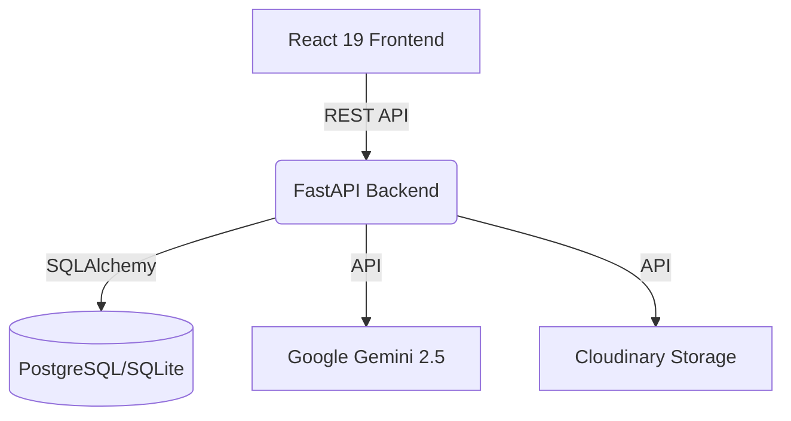

# Obsidian SOC 🛡️


> **Stop reading raw logs. Start understanding threats.**

Obsidian SOC is an enterprise-grade AI-powered Security Operations Workspace designed to transform raw security events into actionable intelligence. Built with modern product design principles, scalable full-stack engineering, and AI-assisted incident investigation capabilities.

## 🚀 Overview

Modern SOC analysts are drowning in unstructured log data. Obsidian SOC solves this by providing a unified workspace where analysts can upload logs, investigate auto-generated incidents, collaborate with AI, visualize threats, and generate executive reports. 

Featuring both **Analyst Mode** (for deep-dive investigations) and **CEO Mode** (for high-level executive risk assessment), the platform adapts to the needs of the entire organization.

## ✨ Key Features

* **Automated Log Parsing:** Ingest and normalize `.json`, `.csv`, `.log`, and `.txt` files automatically.
* **AI Investigations:** Native integration with Google Gemini 2.5 Flash for autonomous log analysis, MITRE ATT&CK mapping, and remediation suggestions.
* **Mission Control Dashboards:** Beautiful, interactive dashboards displaying KPI metrics, live activity feeds, and AI briefings.
* **Dual Personas:** Seamlessly toggle between Analyst and CEO perspectives.
* **Enterprise UX:** Includes a global Command Palette (`CTRL+K`), shimmer loading states, and polished micro-interactions using Framer Motion.
* **Secure by Default:** JWT authentication, bcrypt password hashing, and strict CORS configuration.

## 🏗️ Architecture



## 🛠️ Technology Stack

* **Frontend:** React 19, TypeScript, Vite, Tailwind CSS v4, Framer Motion, Lucide Icons, React Router.
* **Backend:** FastAPI, Python, SQLAlchemy, Alembic, Pydantic, Passlib, Python-Jose.
* **Database:** PostgreSQL (Production) / SQLite (Local Development).
* **AI Engine:** Google Gemini 2.5 Flash.
* **File Storage:** Cloudinary.
* **Deployment:** Render (Static Site & Web Service).

## 🚦 Getting Started

### Prerequisites
* Node.js v20+
* Python 3.10+
* Google Gemini API Key

### Local Development

1. **Clone the repository:**
   ```bash
   git clone https://github.com/Charan291005/OBSIDIAN-SOC.git
   cd OBSIDIAN-SOC
   ```

2. **Setup Backend:**
   ```bash
   cd backend
   python -m venv venv
   source venv/Scripts/activate # Windows
   pip install -r requirements.txt
   
   # Duplicate .env.example to .env and add your API keys
   cp .env.example .env
   
   # Run migrations & seed data
   alembic upgrade head
   python -m database.seed
   
   # Start server
   uvicorn app.main:app --reload
   ```

3. **Setup Frontend:**
   ```bash
   cd frontend
   npm install
   npm run dev
   ```

4. Open `http://localhost:5173` in your browser.

## 📖 Documentation
Detailed documentation is available in the `/docs` directory:
- [Architecture](docs/PRD_Part1.md)
- [Design System & Requirements](docs/PRD_Part3.md)
- [Engineering Standards](docs/PRD_Part4.md)

## 🤝 Contributing
Please see `CONTRIBUTING.md` for details on our code of conduct and the process for submitting pull requests.

## 🛡️ Security
If you discover a security vulnerability within Obsidian SOC, please review our `SECURITY.md` file.

## 📄 License
This project is licensed under the MIT License - see the `LICENSE` file for details.
